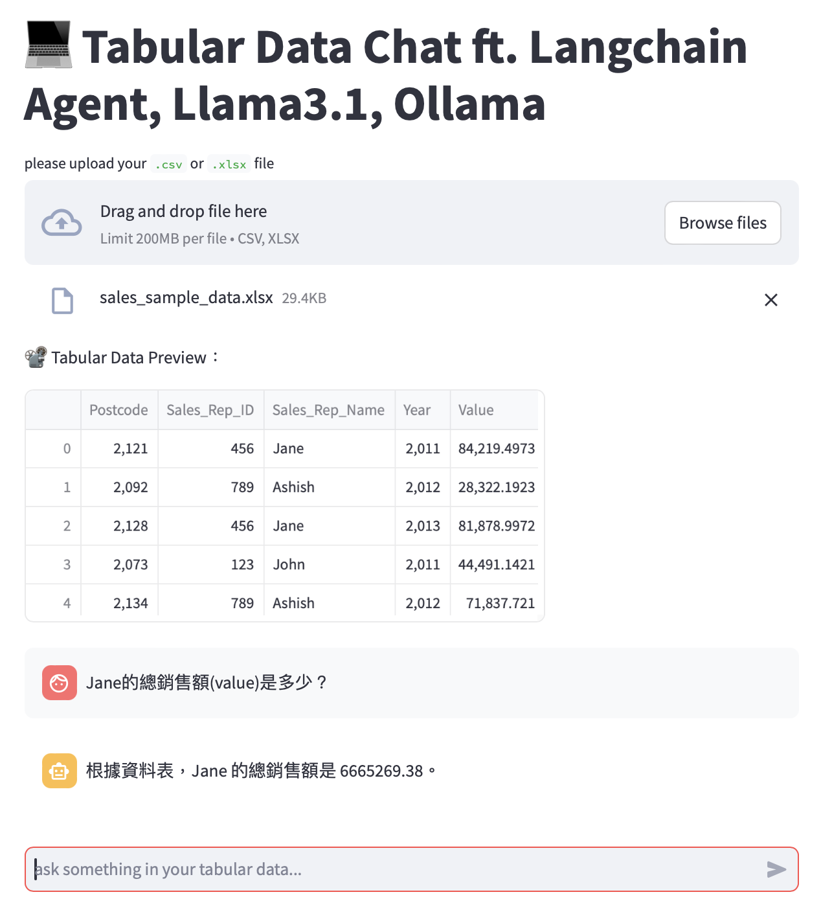

# LANGCHAIN PANDAS AGENT

> **Chat with the `CSV` or `XLSX` file uploaded**

## Chat Example

## Project Overview
> [!IMPORTANT]
> In this project, I have developed a `Langchain Pandas Agent` with the following components：
> - Agent: **create_pandas_dataframe_agent**
> - Large Language Model: **llama3.1 8b**
> - Large Language Model Framework: **Ollama**
> - Web UI Framework: **Streamlit**
> - Reverse Proxy Tool: **Ngrok**

<aside style="background-color:yellow;">This **Langchain Pandas Agent** allows users to upload their own **CSV** or **XLSX** file and chat with the uploaded file in Traditional Chinese.</aside> 

> [!WARNING]
> There are some warning messages mentioned in the Langchain documentation regarding the use of `create_pandas_dataframe_agent` as below：

<aside style="background-color:yellow;">This agent relies on access to a python repl tool which can execute arbitrary code. This can be dangerous and requires a specially sandboxed environment to be safely used. Failure to run this code in a properly sandboxed environment can lead to arbitrary code execution vulnerabilities, which can lead to data breaches, data loss, or other security incidents. 
Do not use this code with untrusted inputs, with elevated permissions, or without consulting your security team about proper sandboxing! 
You must opt-in to use this functionality by setting allow_dangerous_code=True.</aside> 

## References
> The code in this project refers to some references mentioned below：
- [run streamlit with ngrok](https://www.kaggle.com/code/amlanmohanty1/build-web-app-for-heart-disease-with-streamlit#Write-a-file-for-creating-web-app)
- [langchain agent with gemma:2b](https://www.youtube.com/watch?v=u3SGDvOVyO4)
- [how to work with ollama](https://stackoverflow.com/questions/78394289/running-ollama-on-kaggle)
- [ollama official website](https://ollama.com/library/llama3.1:8b)
